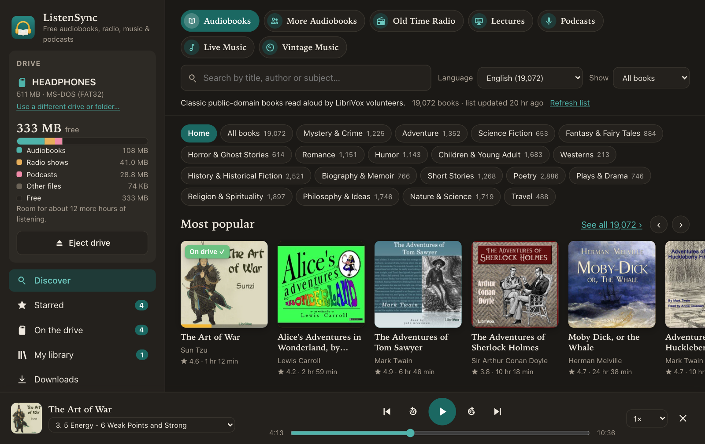
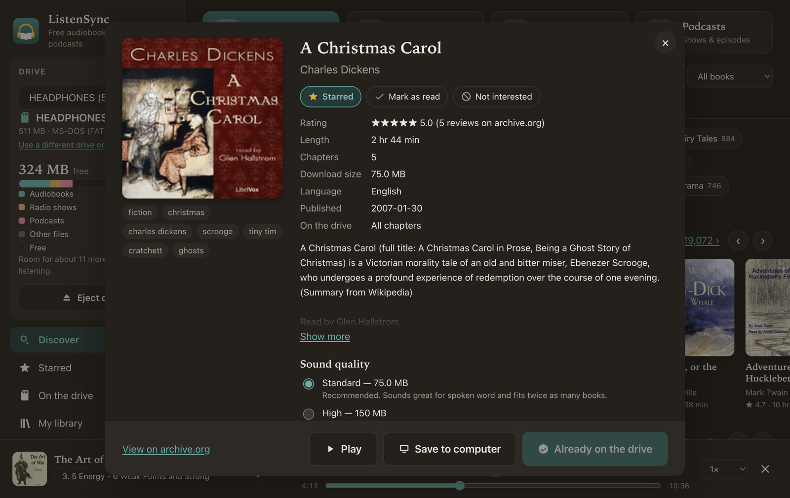
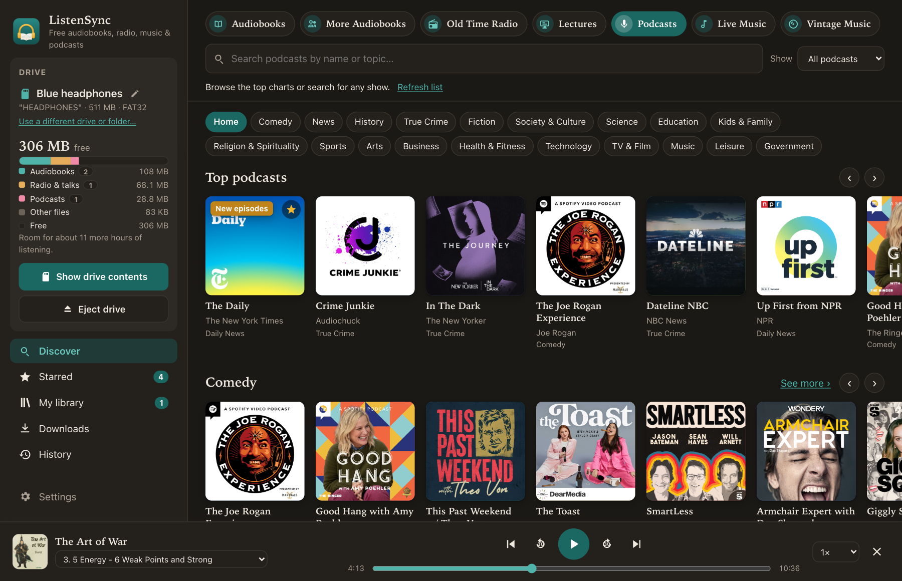
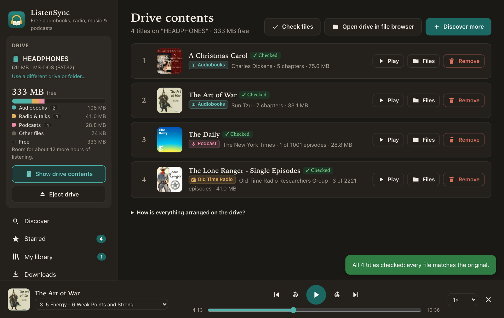
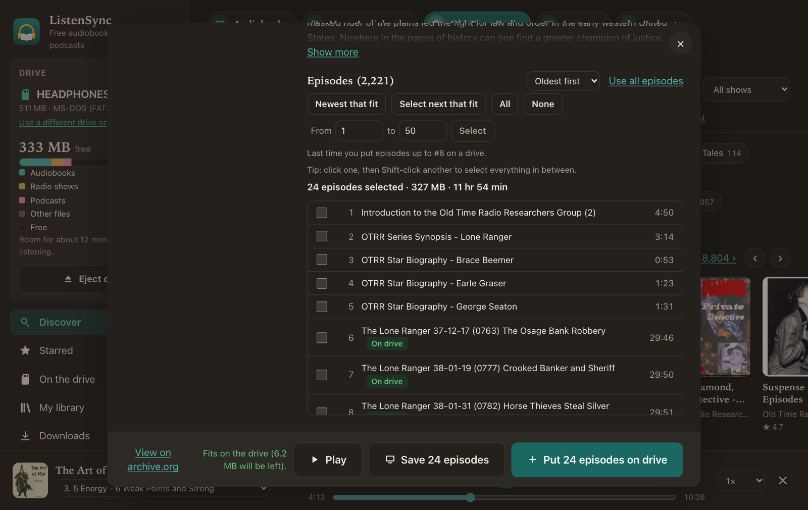
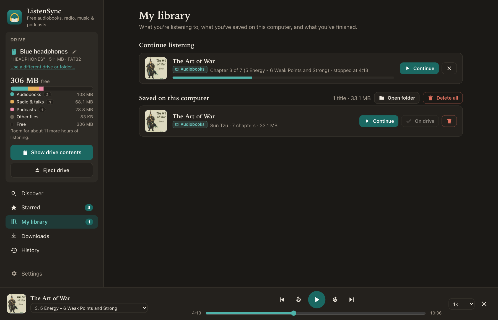
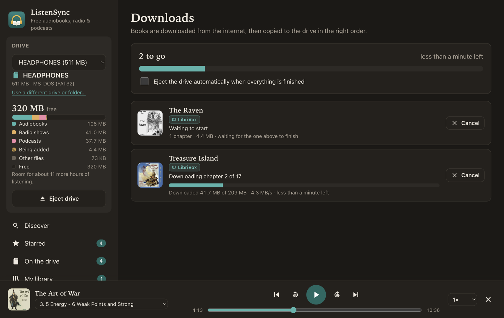

# ListenSync

A simple desktop app (macOS, Windows, Linux) for finding free audiobooks, old-time radio, live
concerts, lectures, vintage 78 rpm records and podcasts, listening to them on your computer, and syncing them to an SD card, USB stick or
MP3 player (for example headphones with a card slot), with everything in the right play order.

**[Download ListenSync](https://hypnopompia.github.io/ListenSync/)** for macOS or Windows
(or see [all releases](https://github.com/Hypnopompia/ListenSync/releases/latest)).



<table>
  <tr>
    <td width="50%"><br><sub>Details, ratings and chapters for every book</sub></td>
    <td width="50%"><br><sub>Podcasts: top charts by category, plus search</sub></td>
  </tr>
  <tr>
    <td><br><sub>What's on the drive, checked and in play order</sub></td>
    <td><br><sub>Long series and podcasts: pick the next batch that fits</sub></td>
  </tr>
  <tr>
    <td><br><sub>Listen on the computer and pick up where you left off</sub></td>
    <td><br><sub>Downloads with progress and time left</sub></td>
  </tr>
</table>

## What it does

- **Browse free audio** from six Internet Archive collections:
  - **LibriVox**: about 21,000 public-domain books read by volunteers
  - **Community Audiobooks**: about 50,000 member uploads (quality varies)
  - **Old Time Radio**: about 8,800 classic radio dramas and comedies
  - **Live Music**: about 37,000 of the most played concerts from the [Live Music Archive](https://archive.org/details/etree)
    (bands that allow taping and sharing), with a shelf for each of the top bands. Shows that archive.org
    only allows streaming, like most Grateful Dead soundboards, are left out.
  - **Lectures & Speeches**: about 2,700 famous speeches, college lectures and talks, by topic
  - **78 RPM Records**: about 11,700 of the most played sides from the [Great 78 Project](https://great78.archive.org),
    by genre (jazz, blues, country, popular songs, classical and more)
- **Home shelves**: Most popular, Top rated, Short listens, Recently added, and a shelf for each genre (Mystery & Crime, Adventure, Science Fiction, Fantasy, Horror, Romance, Humor, Children & Young Adult, Westerns, History, Biography, Short Stories, Poetry, Plays, Religion, Philosophy, Nature & Science, Travel). Genres come from each book's subject tags.
- **Podcasts**: Apple's Top Podcasts charts (overall and by category) and search through
  [Podcast Index](https://podcastindex.org), falling back to Apple's directory without an API key.
  Episodes download straight from the publisher. Only MP3 episodes are offered, since AAC and video
  episodes won't play on many headphones. Podcasts use the same batch tools as books: newest that fit,
  next that fit, ranges, save to computer, play, check and repair. **Follow** a show (the star) to have it
  listed under Starred, with a **New episodes** badge when it publishes something new. Episode numbers
  stay stable even for feeds that only list their newest episodes.
- **Genre chips** with counts, search by title, author or subject, filter by language, and sort by popularity, rating, title, author, newest or length.
- **Ratings** from archive.org listeners on covers and in book details. "Highest rated" weights by number of reviews, so a single 5-star review doesn't top the list. Only a minority of books have ratings.
- See cover art, author, length, description, download size and the chapter list for each book.
- **Caches the book list** on the computer, so it opens instantly after the first load. It refreshes in the background once a week, or when you click "Refresh list".
- **Detects drives automatically** (SD cards, USB sticks, players that show up as a drive) and shows how much space is used and free, plus roughly how many hours of listening still fit.
- **Checks free space** before downloading. If a book won't fit, it offers to remove books from the card to make room.
- **Shows download progress**, speed and time remaining for each book and for the whole list.
- **Manages the card**: see what's on it, remove books, open folders in Finder or File Explorer.
- **Ejects the card** with one click, or automatically when all downloads finish.
- **Save to computer**: download a book now, then listen on the computer or copy it to an SD card later without downloading it again. Saved books live in `Music/ListenSync/`.
- **My library**: continue listening where you left off, manage books saved on this computer (Play, Copy to SD card, Delete, Delete all, disk usage), and see finished books.
- **Starred** in the sidebar: quick access to every book you've starred.
- **Check books** on the SD card screen: reads every chapter back from the card and compares its size and MD5 checksum with the original. The reference is the checksum list saved with the book, then the copy on this computer, then archive.org's published checksums. Damaged or incomplete books are flagged with a **Repair** button, and the "On SD card" badge changes to "Check SD card" or "On SD card ✓".
- **Star / Mark as read / Not interested** on any book. "Not interested" books are hidden while browsing. The "Show" filter switches between all, starred, unread, read and hidden books.
- **Choose chapters or episodes**: long books and radio series (some have thousands of episodes) can be copied or saved in batches. "Select next that fit" picks as many consecutive episodes as fit on the card, continuing after the last batch you copied, so you can rotate through a series. Also available: All, None, a from/to range, and Shift-click. Batches keep their original numbers (`0763 - …mp3`) in folders like "The Lone Ranger (episodes 101-185)", and the player resumes by episode number across batches.
- **Split long chapters** (Settings): when copying to an SD card, chapters longer than the chosen length (10–30 minutes) are cut into numbered parts, so players that forget their place have less to skip through. Splitting is done in plain JavaScript on MP3 frame boundaries, with no re-encoding and no ffmpeg. Each part gets its own title, album, artist and track tags.
- **Download integrity**: every download is checked against archive.org's MD5 checksum and retried if it doesn't match.
- **Built-in player** for books on the computer or the SD card: chapter list, back/forward 30 s, playback speed, and keyboard media keys. The listening position is saved every few seconds, and finishing the last chapter marks the book as read.

## How books are stored on a drive

```
Drive/
  Adventures of Tom Sawyer - Mark Twain/
    001 - Chapter 01-02.mp3
    002 - Chapter 03.mp3
    ...
  Pride and Prejudice - Jane Austen/
    001 - Chapter 01.mp3
    ...
```

### Play order (why this app exists)

Many cheap MP3 players, including most headphones with an SD slot, ignore
file names. They play files in the order of the FAT32 directory table, which
is roughly the order the files were written. Deleting files leaves gaps that
later files can fill, which scrambles the order. The app handles this as
follows:

1. Every chapter is numbered with leading zeros (`001`, `002`, …), so players that *do* sort by name also get it right.
2. Chapters are downloaded to the computer first, then copied to the card **one at a time, in order**, into a brand-new folder.
3. **Fix play order** rebuilds each book folder by moving its files into a fresh folder in sorted order. It also puts book folders back in alphabetical order, filling directory gaps first so a short name can't jump ahead of a long one. This works like the Linux tool `fatsort`, but uses ordinary file moves that work on any OS. It runs automatically after downloads finish, and from a button whenever the app finds something out of order (for example, after files were copied by hand).
4. Hidden macOS `._*` files, which some players try to play as broken tracks, are removed from the card.

Book folders sit at the top level of the card, because some players only look one folder deep.

## Running it

Requires [Node.js](https://nodejs.org) 20 or newer.

```bash
npm install
npm start
```

## API keys

Podcast search uses the free [Podcast Index](https://api.podcastindex.org) API. Put your own
credentials in a `.env` file (copy `.env.example`); it is gitignored and never committed.
`npm run dist` / `npm run release` copy them into the packaged app (`src/main/secrets.json`,
also gitignored). Without a key, podcast search falls back to Apple's directory.

Anything inside a desktop app can be extracted by a determined person, so this keeps the key
out of GitHub rather than making it truly secret. If it's ever abused, revoke it on
podcastindex.org, create a new one, and ship an update.

## Building installers

```bash
npm run dist:mac     # universal .dmg (Apple Silicon + Intel)
npm run dist:win     # Windows x64 installer + portable .exe (can be built on a Mac)
npm run dist:linux   # x64 AppImage + .deb
npm run dist         # Mac and Windows together
```

Output goes to `dist/`:

| File | For |
|---|---|
| `ListenSync-<version>-universal.dmg` | macOS (Apple Silicon and Intel) |
| `ListenSync Setup <version>.exe` | Windows 10/11 installer |
| `ListenSync <version>.exe` | Windows portable (no install needed) |

### Opening an unsigned build

The builds are not signed with an Apple Developer ID or a Windows code-signing
certificate, so each system shows a warning the first time:

- **macOS 15 (Sequoia) and later**: open the app once and dismiss the warning, then go to
  **System Settings → Privacy & Security**, scroll down, and click **Open Anyway** next to
  "ListenSync". Confirm, and from then on it opens normally.
  (On macOS 14 and earlier you can instead right-click the app → **Open** → **Open**.)
- **Windows**: on the blue "Windows protected your PC" screen, click **More info**, then **Run anyway**.

To remove these warnings, sign the macOS build with a Developer ID certificate and
notarize it (Apple Developer Program), and sign the Windows build with a code-signing
certificate. electron-builder supports both through environment variables
(`CSC_LINK`/`CSC_KEY_PASSWORD`, `APPLE_ID`/`APPLE_APP_SPECIFIC_PASSWORD`/`APPLE_TEAM_ID`).

## Releasing an update

The app checks [GitHub Releases](https://github.com/Hypnopompia/ListenSync/releases)
for new versions 10 seconds after it starts and then every 6 hours (Settings → About & updates
also has a "Check for updates" button).

- **Windows installer / Linux AppImage**: the update downloads in the background; the user
  clicks **Restart** (or it installs the next time the app is quit).
- **macOS and the Windows portable .exe**: the app says a new version is out and **Download**
  opens the release page. (macOS only lets apps replace themselves when they are signed with a
  Developer ID; once the Mac build is signed and notarized, it switches to full self-updating
  automatically.)

To publish a release:

1. Bump `"version"` in `package.json` (e.g. `1.1.0` → `1.2.0`) and commit.
2. Build and publish (needs the [GitHub CLI](https://cli.github.com) `gh`, logged in):

   ```bash
   npm run release
   ```

   This creates a draft release `v<version>`, builds the Mac and Windows installers, uploads
   them along with the `latest.yml` / `latest-mac.yml` files the updater reads, and then
   publishes the release.

Builds from before v1.1.0 don't include the updater, so they need to be replaced by hand once.

## App icon

The icon source is `build/icon.svg`. After editing it, regenerate the PNGs with:

```bash
npx electron scripts/make-icon.js
```

electron-builder turns `build/icon.png` into the macOS `.icns` and Windows `.ico` files.
When running from source (`npm start`) the macOS menu bar still says "Electron";
the packaged app shows "ListenSync".

## Tests

```bash
npm test
```

On macOS the tests include an integration test that creates a real FAT32
disk image and checks the on-disk directory order after writing, deleting
and fixing books.

To try the app against a disk image instead of a real card (macOS):

```bash
hdiutil create -size 200m -fs "MS-DOS FAT32" -volname TESTCARD -layout MBRSPUD /tmp/card.dmg
hdiutil attach /tmp/card.dmg
SD_LOADER_ALLOW_DISK_IMAGES=1 npm start
```

## Notes

- The SD card should be formatted **FAT32**. Many headphones can't read exFAT, and the app shows a warning for exFAT cards. Cards larger than 32 GB usually come formatted as exFAT.
- **Standard** quality (64 kbps, the default) is plenty for spoken word and fits about twice as many books as **High**. One hour is roughly 29 MB.
- Other free sources were considered. The LibriVox website, Loyal Books and Lit2Go mostly mirror the same LibriVox recordings, or have no API for listing books, so the Internet Archive collections above cover them.

## Project layout

```
src/main/main.js        Electron main process, IPC, drive polling
src/main/catalog.js     archive.org search + metadata, list cache, chapter selection
src/main/drives.js      SD card detection, free space, eject (macOS/Windows/Linux)
src/main/sdcard.js      card listing, ordered writes, fix play order, delete
src/main/downloader.js  download queue: parallel downloads, ordered copy, ETA
src/main/local.js       books saved on this computer (Music/ListenSync)
src/main/libstate.js    starred / read / not interested / listening position (library.json)
src/main/media.js       abook:// protocol that streams MP3s to the player (with seeking)
src/main/verify.js      "Check books": compares card files with expected sizes/MD5s
src/main/mp3split.js    MP3 frame parser + splitter + minimal ID3v2 writer (no ffmpeg)
src/renderer/shelves.js Home shelves, genre chips, Settings dialog
src/main/podcasts.js    podcast directory (Podcast Index / Apple), charts, episodes
src/main/secrets.js     API credentials from .env / the bundled secrets.json
src/renderer/podcasts.js Podcasts browsing and "New episodes" check
src/renderer/           user interface (plain HTML/CSS/JS, no build step)
```

## Credits and disclaimer

Audiobooks come from [LibriVox](https://librivox.org), whose volunteers record public-domain
books, and the [Internet Archive](https://archive.org), which hosts them and the other
collections the app can browse. Cover images and ratings are loaded from archive.org.

This project is **not affiliated with or endorsed by LibriVox or the Internet Archive**.
LibriVox recordings are in the public domain in the USA; listeners elsewhere should check
the copyright status in their country. Recordings uploaded by Internet Archive members may
be under copyright: you are responsible for making sure your use is allowed where you live.
The app identifies itself to archive.org with a link to this repository and keeps its
requests modest (a weekly catalog refresh and at most three downloads at a time).

## License

[MIT](LICENSE)

